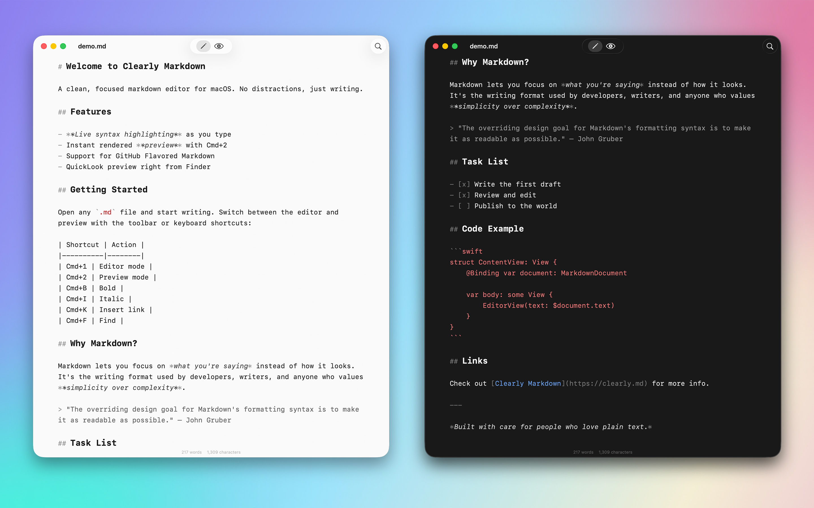

<p align="center">
  
</p>

<h1 align="center">Clearly Markdown</h1>

<p align="center">A native markdown editor and document workspace for macOS.</p>

<p align="center">
  <a href="https://github.com/Shpigford/clearly/releases/latest/download/Clearly.dmg">Download</a> &middot;
  <a href="https://clearly.md">Website</a> &middot;
  <a href="https://x.com/Shpigford">@Shpigford</a>
</p>

<p align="center">
  
</p>

Open folders, browse your files, write with syntax highlighting, and preview instantly. No Electron, no subscriptions, no bloat.

## Features

- **File explorer** — open folders, browse markdown files in a sidebar with bookmarked locations and recents
- **Document outline** — navigable header outline panel for jumping between sections (⇧⌘O)
- **Syntax highlighting** — headings, bold, italic, links, code blocks, and more
- **Instant preview** — rendered GitHub Flavored Markdown, including Mermaid diagrams and KaTeX math
- **Frontmatter support** — YAML frontmatter is formatted cleanly in both editor and preview
- **Editor/Preview toggle** — switch between editor (⌘1) and preview (⌘2) with scroll position preserved
- **PDF export** — export to PDF or print directly from the app
- **Format shortcuts** — Cmd+B, Cmd+I, Cmd+K for bold, italic, and links
- **Scratchpad** — menubar app with a global hotkey for capturing quick notes without opening a document
- **QuickLook** — preview .md files right in Finder
- **Light & Dark** — follows system appearance or set manually

## Prerequisites

- **macOS 14** (Sonoma) or later
- **Xcode** with command-line tools (`xcode-select --install`)
- **Homebrew** ([brew.sh](https://brew.sh))
- **xcodegen** — `brew install xcodegen`

Sparkle (auto-updates) and cmark-gfm (markdown rendering) are pulled automatically by Xcode via Swift Package Manager. No manual setup needed.

## Quick Start

```bash
git clone https://github.com/Shpigford/clearly.git
cd clearly
brew install xcodegen    # skip if already installed
xcodegen generate        # generates Clearly.xcodeproj from project.yml
open Clearly.xcodeproj   # opens in Xcode
```

Then hit **Cmd+R** to build and run.

> **Note:** The Xcode project is generated from `project.yml`. If you change `project.yml`, re-run `xcodegen generate`. Don't edit the `.xcodeproj` directly.

### CLI build (no Xcode GUI)

```bash
xcodebuild -scheme Clearly -configuration Debug build
```

## Project Structure

```
Clearly/
├── ClearlyApp.swift                # @main entry — DocumentGroup + menu commands (⌘1/⌘2)
├── MarkdownDocument.swift          # FileDocument conformance for reading/writing .md files
├── ContentView.swift               # Mode picker toolbar, switches Editor ↔ Preview
├── EditorView.swift                # NSViewRepresentable wrapping NSTextView
├── MarkdownSyntaxHighlighter.swift # Regex-based highlighting via NSTextStorageDelegate
├── PreviewView.swift               # NSViewRepresentable wrapping WKWebView
├── Theme.swift                     # Centralized colors (light/dark) and font constants
└── Info.plist                      # Supported file types, Sparkle config

ClearlyQuickLook/
├── PreviewViewController.swift     # QLPreviewProvider for Finder previews
└── Info.plist                      # Extension config (NSExtensionAttributes)

Shared/
├── MarkdownRenderer.swift          # cmark-gfm wrapper — GFM → HTML
└── PreviewCSS.swift                # CSS shared by in-app preview and QuickLook

website/                 # Static marketing site (HTML/CSS), deployed to clearly.md
scripts/                 # Release pipeline (release.sh)
project.yml              # xcodegen config — source of truth for Xcode project settings
ExportOptions.plist      # Developer ID export config for release builds
```

## Architecture

**SwiftUI + AppKit**, document-based app with two modes.

### App lifecycle

1. `ClearlyApp` creates a `DocumentGroup` with `MarkdownDocument` (handles `.md` file I/O)
2. `ContentView` renders a toolbar mode picker and switches between `EditorView` and `PreviewView`
3. Menu commands (⌘1 Editor, ⌘2 Preview) use `FocusedValueKey` to communicate across the responder chain

### Editor

The editor wraps AppKit's `NSTextView` via `NSViewRepresentable` — **not** SwiftUI's `TextEditor`. This is intentional: it provides native undo/redo, the system find panel (⌘F), and `NSTextStorageDelegate`-based syntax highlighting that runs on every keystroke.

`MarkdownSyntaxHighlighter` applies regex patterns for headings, bold, italic, code blocks, links, blockquotes, and lists. Code blocks are matched first to prevent inner highlighting.

### Preview

`PreviewView` wraps `WKWebView` and renders the full HTML preview using `MarkdownRenderer` (cmark-gfm) styled with `PreviewCSS`.

### Key design decisions

- **AppKit bridge** — `NSTextView` over `TextEditor` for undo, find, and `NSTextStorageDelegate` syntax highlighting
- **Dynamic theming** — all colors go through `Theme.swift` with `NSColor(name:)` for automatic light/dark resolution. Don't hardcode colors.
- **Shared code** — `MarkdownRenderer` and `PreviewCSS` compile into both the main app and the QuickLook extension
- **No test suite** — validate changes manually by building, running, and observing

## Common Dev Tasks

### Add a supported file type

Edit `Clearly/Info.plist` — add a new entry under `CFBundleDocumentTypes` with the UTI and file extension.

### Change syntax highlighting

Edit `Clearly/MarkdownSyntaxHighlighter.swift`. Patterns are applied in order — code blocks first, then everything else. Add new regex patterns to the `highlightAllMarkdown()` method.

### Modify preview styling

Edit `Shared/PreviewCSS.swift`. This CSS is used by both the in-app preview and QuickLook extension. Keep it in sync with `Theme.swift` colors.

### Update theme colors

Edit `Clearly/Theme.swift`. All colors use `NSColor(name:)` with dynamic light/dark providers. Update the corresponding CSS in `PreviewCSS.swift` to match.

## Testing

No automated test suite. Validate manually:

1. Build and run the app (Cmd+R)
2. Open a `.md` file and verify syntax highlighting
3. Switch to preview mode (⌘2) and verify rendered output
4. Test QuickLook by selecting a `.md` file in Finder and pressing Space
5. Check both light and dark mode

## Website

The marketing site is static HTML in `website/`, deployed to [clearly.md](https://clearly.md).

- `website/index.html` — landing page (version string on line 174)
- `website/privacy.html` — privacy policy
- `website/appcast.xml` — Sparkle auto-update feed (updated by `scripts/release.sh`)

## AI Agent Setup

This repo includes a `CLAUDE.md` file with full architecture context and Claude Code skills in `.claude/skills/` for release automation and dev onboarding. If you're using Claude Code, these are picked up automatically.

## License

MIT — see [LICENSE](LICENSE).
